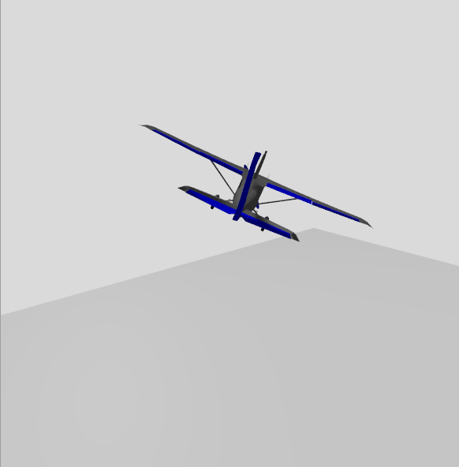
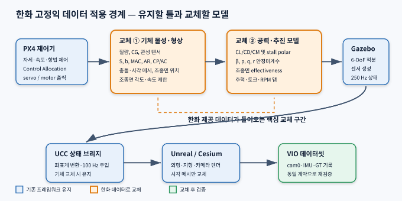
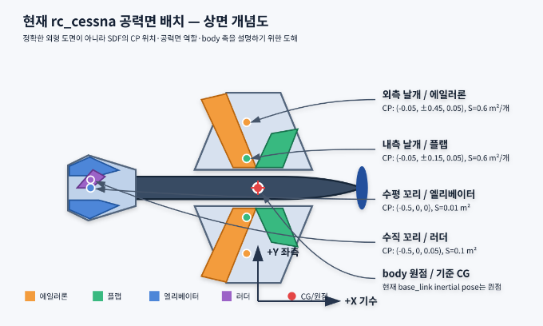

# Gazebo 고정익 기체·공력 모델 기준서

## PX4 `rc_cessna_ucc` 현행 모델 분석 및 한화 고정익 데이터 교체 지침

| 항목 | 내용 |
|---|---|
| 문서 목적 | 현행 고정익 모델의 물리·공력·추진·조종 계통 설명과 한화 제공 데이터 적용 경계 정의 |
| 기준 모델 | PX4 Gazebo `rc_cessna`, UCC wrapper `rc_cessna_ucc` |
| 기준 소프트웨어 | PX4 commit `d6f12ad1c4f7`, PX4 Gazebo models `b6127f4ec20d`, Gazebo Sim 8.14.0 |
| 작성일 | 2026-07-21 |
| 상태 | 현행 모델 분석 완료 / 한화 실기체 데이터 수신 전 기준본 |
| 보안 주의 | 본 문서에는 현재 한화 고유 제원이나 비공개 공력 데이터가 포함되어 있지 않음 |



> **핵심 결론**
>
> PX4 제어기, Gazebo 6-DoF 적분, UCC 상태 브리지, Unreal/Cesium 렌더링,
> VIO 데이터 기록이라는 큰 틀은 그대로 재사용할 수 있다. 한화 데이터가 들어오면
> **기체 물성·형상, 공력계수, 조종면 효과, 추진계 맵과 PX4 airframe 파라미터**를
> 교체한다. 현재 `rc_cessna` 수치는 정밀 공력 검증용이 아니라 통합 비행용 튜닝
> 모델에 가깝다.

<div class="page-break"></div>

## 1. 문서 목적과 적용 범위

이 문서는 다음 질문에 답하기 위한 기준 문서다.

1. 현재 Gazebo에서 어떤 고정익 모델이 실제로 비행하는가?
2. 질량, 관성, 충돌 형상, 공력면, 추진력은 어디에서 정의되는가?
3. Gazebo가 양력·항력·모멘트를 어떤 식으로 계산하는가?
4. PX4 출력이 에일러론, 엘리베이터, 러더, 플랩과 어떻게 연결되는가?
5. 한화로부터 기체 정보를 받으면 어떤 항목과 파일을 바꿔야 하는가?
6. 교체 후 무엇을 시험해야 기존 VIO 파이프라인을 유지하면서 기체 동역학을
   신뢰할 수 있는가?

고정익 시뮬레이션의 데이터 흐름과 소프트웨어 구조는 대부분 공통으로 재사용할
수 있다. 다만 다음 항목은 기체별 차이가 크므로 “고정익은 유사하다”는 이유로
현재 값을 그대로 사용하면 안 된다.

- 질량, CG와 관성 텐서
- 기준 날개 면적, span, MAC, aspect ratio
- 양력·항력 polar와 stall 특성
- 종·횡·방향 안정미계수
- 조종면 크기, 변위 제한, 속도 제한과 effectiveness
- 프로펠러/모터/엔진 추력·토크 맵
- trim 속도, stall 속도, 상승률, 활공비 등 기준 성능

본 문서는 한화 기체 데이터가 도착하기 전의 **교체 명세서 겸 현행 모델 감사
기록**으로 사용한다.

## 2. 전체 구조와 한화 데이터 교체 경계



### 2.1 그대로 유지할 부분

- PX4의 고정익 자세·속도·항법 제어 구조
- Gazebo 서버, 250 Hz 물리 적분 및 센서 생성 구조
- `/ucc/fixed_wing/kinematics` 상태 계약
- Gazebo ENU/FLU에서 AirSim NED/FRD로의 좌표 변환
- UCC External Physics 100 Hz 주입
- Unreal/Cesium 지형, 카메라와 데이터 기록 파이프라인
- `cam0`, IMU, Ground Truth 데이터셋 형식과 검증기

### 2.2 한화 값으로 교체할 부분

- Gazebo 기체 `model.sdf`의 질량, CG, 관성, collision과 링크 배치
- 공력 플러그인의 기준 형상과 공력계수
- 각 조종면의 위치, 회전축, 각도/속도 제한과 제어 미계수
- 프로펠러·모터 또는 엔진의 추력/토크 모델
- PX4 airframe의 control allocation, trim과 고정익 제어 파라미터
- Unreal에서 표시할 실제 기체 외형 메시, 크기와 로컬 축 보정

## 3. 현재 실제 실행 모델

실행 스크립트는 다음 값을 사용한다.

```text
PX4_SYS_AUTOSTART=4003
PX4_SIM_MODEL=gz_rc_cessna_ucc
PX4_GZ_MODELS=tools/fixedwing/ucc_fixedwing_mvp_v1/gz_models
```

`rc_cessna_ucc`는 새로운 공력 모델이 아니다. 다음과 같이 PX4 기본
`rc_cessna`를 merge include하고 UCC 상태 발행기만 추가한다.

```xml
<model name="rc_cessna_ucc">
  <include merge="true">
    <uri>rc_cessna</uri>
  </include>
  <plugin filename="libUccKinematicsPublisher.so"
          name="ucc::sim::systems::KinematicsPublisher">
    <link_name>base_link</link_name>
    <topic>/ucc/fixed_wing/kinematics</topic>
    <publish_rate_hz>250</publish_rate_hz>
  </plugin>
</model>
```

따라서 실제 질량·관성·공력·추진 정의는 다음 PX4 Gazebo model 파일에 있다.

```text
/home/boss/PX4-Autopilot/Tools/simulation/gz/models/rc_cessna/model.sdf
```

UCC `KinematicsPublisher`는 위치·자세·속도·가속도를 읽어 전송할 뿐 힘이나
모멘트를 생성하지 않는다.

## 4. 기체 종류, 좌표계와 단위

### 4.1 기체 종류

현재 모델은 실물 탑승형 Cessna가 아니라 약 1 m span을 가진 소형
**RC Cessna 형상 고정익**이다.

- 단발 tractor/puller 프로펠러
- 고익(high wing) 형상
- 좌·우 에일러론
- 좌·우 플랩 링크
- 단일 엘리베이터와 러더
- 삼륜 착륙장치
- 모델 총질량 약 1.67 kg

### 4.2 Gazebo body 좌표

```text
+X : 기수/전방
+Y : 좌측
+Z : 상방
```

이는 Gazebo ENU/FLU 계열이다. PX4 내부의 body FRD와 AirSim NED/FRD로 전달할
때는 기존 브리지에서 축과 quaternion을 변환한다. 한화 모델을 만들 때도 Gazebo
기체 메시와 공력 플러그인 기준축은 반드시 `+X forward`, `+Y left`, `+Z up`으로
통일한다.

### 4.3 단위

- 길이: m
- 질량: kg
- 관성: kg·m²
- 각도: SDF 내부 rad
- 속도: m/s, rad/s
- 힘/모멘트: N, N·m
- 공기 밀도: kg/m³

<div class="page-break"></div>

## 5. 현행 물리 모델

### 5.1 질량과 관성

| 링크 | 질량 |
|---|---:|
| `base_link` | 1.500 kg |
| airspeed 링크 | 0.015 kg |
| 프로펠러 링크 | 0.005 kg |
| 좌·우·전륜 | 0.150 kg |
| 조종면 링크 합계 | 약 0 kg에 가까운 수치 |
| **총질량** | **약 1.670 kg** |

`base_link`의 관성은 다음과 같다.

| 항목 | 값 (kg·m²) |
|---|---:|
| `Ixx` | 0.1975630 |
| `Iyy` | 0.1458929 |
| `Izz` | 0.1477000 |
| `Ixy`, `Ixz`, `Iyz` | 0 |

현재 inertial pose는 body 원점이며 별도 CG offset이 없다. 한화 데이터가 CG
위치와 관성 기준점을 제공하면 inertial pose 및 평행축 정리 적용 여부를 함께
확인해야 한다.

### 5.2 충돌 형상

- 동체: box `0.65 × 0.08 × 0.10 m`, X offset `-0.14 m`
- 주익: box `0.10 × 1.00 × 0.01 m`, Z offset `+0.07 m`
- 좌·우 주륜: radius `0.03 m`, width `0.01 m`
- 전륜: radius `0.025 m`, width `0.01 m`
- 프로펠러: box `0.005 × 0.22 × 0.02 m`

공력 면적과 collision 면적은 서로 독립이다. 현재 collision 주익 평면 면적은
약 `0.1 m²`지만 공력 플러그인에 입력된 주익 계열 유효 면적 합은 `2.4 m²`다.
따라서 현행 공력 면적은 형상에서 계산한 물리 면적이라기보다 비행 동작을 위한
튜닝값으로 봐야 한다.

### 5.3 물리 적분과 환경

| 항목 | 현행 값 |
|---|---:|
| Physics engine | Gazebo ODE |
| 적분 step | 0.004 s |
| update rate | 250 Hz |
| 중력 | `0 0 -9.8 m/s²` |
| 대기 | adiabatic atmosphere 선언 |
| LiftDrag 공기 밀도 | `1.2041 kg/m³` 고정 |
| 바람 | 현재 없음 |

대기가 선언되어 있어도 현행 `LiftDrag`는 각 플러그인의 고정 `air_density`를
사용한다. 한화 요구사항에 고도별 성능이 포함되면 밀도 모델을 별도로 처리해야
한다.

## 6. 현행 공력 모델 개요

현행 모델은 Gazebo Sim 8.14의 기본 `LiftDrag` 시스템 6개를 `base_link`에
부착한다. 이것은 CFD, panel method 또는 blade element 해석이 아니라 각
공력면을 선형 계수와 piecewise stall 곡선으로 표현하는 저차 모델이다.



### 6.1 상대속도와 받음각

각 공력면의 CP에서 다음 상대속도를 계산한다.

```text
Vcp = Vcg + omega × rcp - Vwind
```

그 뒤 공력면의 `forward`, `upward`로 정의된 lift-drag plane에 속도를 투영해
받음각 `alpha`와 sweep 성분을 구한다. 속도가 전방 벡터의 반대 방향이면 힘을
생성하지 않는다.

### 6.2 동압

```text
q = 0.5 × rho × Vplane²
```

현행 모든 공력면은 `rho = 1.2041 kg/m³`를 사용한다.

### 6.3 양력

stall 전 기본식은 다음과 같다.

```text
CL = CLa × alpha × cos²(sweep)
CL = CL + control_joint_rad_to_cl × delta
Lift = CL × q × S
```

`a0`는 계산 받음각에 더해지는 초기 받음각 offset 역할을 한다. `delta`는 연결된
Gazebo 조인트의 실제 회전각이다.

stall 이후에는 `alpha_stall`, `CLa_stall`을 사용하는 piecewise 직선으로
전환하고, 양의 받음각에서 `CL ≥ 0`, 음의 받음각에서 `CL ≤ 0`으로 제한한다.

### 6.4 항력

stall 전 기본식은 다음과 같다.

```text
CD = abs(CDa × alpha × cos²(sweep))
Drag = CD × q × S
```

현재 플러그인은 `CD0 + kCL²` 형태의 parasite/induced drag를 사용하지 않는다.
조종면 각도 역시 현행 구현에서는 `CD`를 바꾸지 않는다.

### 6.5 공력 모멘트

```text
CM = CMa × alpha + CMdelta × delta
Moment = CM × q × S
Total torque = Moment + rcp × (Lift + Drag)
```

현행 SDF는 모든 공력면의 `CMa=0`, `CMdelta=0`이므로 직접 공력 모멘트는 0이다.
실제 회전 모멘트 대부분은 CP offset에서 힘을 적용한 `rcp × F`로 만들어진다.

### 6.6 공식 구현 기준

계산식 기준은 Gazebo Sim 8.14.0의 다음 소스다.

```text
https://github.com/gazebosim/gz-sim/blob/
gz-sim8_8.14.0/src/systems/lift_drag/LiftDrag.cc
```

<div class="page-break"></div>

## 7. 현행 공력면별 계수

공통값:

```text
CLa          = 4.752798721 /rad
alpha_stall  = 0.3391428111 rad = 19.43 deg
CLa_stall    = -3.85 /rad
CDa_stall    = -0.9233984055 /rad
CMa          = 0
CMa_stall    = 0
rho          = 1.2041 kg/m³
forward      = (1, 0, 0)
```

| 공력면 | CP (m) | S (m²) | `a0` (rad) | `CDa` | 조종 gain `dCL/dδ` |
|---|---:|---:|---:|---:|---:|
| 좌 에일러론/외측 날개 | `(-0.05,+0.45,+0.05)` | 0.6 | 0.0598428 | 1.5 | -0.3 |
| 우 에일러론/외측 날개 | `(-0.05,-0.45,+0.05)` | 0.6 | 0.0598428 | 1.5 | -0.3 |
| 좌 플랩/내측 날개 | `(-0.05,+0.15,+0.05)` | 0.6 | 0.0598428 | 0.6417112 | -0.1 |
| 우 플랩/내측 날개 | `(-0.05,-0.15,+0.05)` | 0.6 | 0.0598428 | 0.6417112 | -0.1 |
| 엘리베이터/수평 꼬리 | `(-0.50,0,0)` | 0.01 | -0.2 | 0.6417112 | -4.0 |
| 러더/수직 꼬리 | `(-0.50,0,+0.05)` | 0.1 | 0 | 0.6417112 | +0.8 |

러더만 `upward=(0,1,0)`을 사용해 횡방향 힘을 만든다. 나머지는
`upward=(0,0,1)`이다.

### 7.1 수치 sanity check

body 받음각 0도, 조종면 0도, `V=15 m/s`라는 단순 조건에서 외측/내측 날개
4개만 계산하면 다음 수준이다.

| 항목 | 계산값 |
|---|---:|
| 동압 | 135.46 Pa |
| 각 날개 요소의 `CL` | 약 0.2844 |
| 날개 4개 총양력 | 약 92.5 N |
| 날개 4개 총항력 | 약 20.8 N |
| 1.67 kg 기체 중량 | 약 16.4 N |

실제 비행에서는 기체가 음의 trim 받음각을 가져 양력이 줄어든 상태에서 균형을
잡는다. 이 계산은 현행 면적·계수가 실제 RC 기체의 기하 기반 값이 아니라는 점을
보여주는 참고치이며, 실제 비행 상태의 힘을 그대로 의미하지 않는다.

## 8. 추진 모델

프로펠러는 Gazebo `MulticopterMotorModel`을 fixed-wing puller로 재사용한다.

| 항목 | 현행 값 |
|---|---:|
| 위치 | body `X=+0.22 m` |
| 회전 방향 | CW |
| 상승 time constant | 0.0125 s |
| 하강 time constant | 0.025 s |
| 최대 회전속도 | 1000 rad/s |
| motor constant | `1.2e-5` |
| moment constant | 0.016 |
| rotor drag coefficient | `8.06428e-5` |
| rolling moment coefficient | `1e-6` |

이 모델은 실제 프로펠러 직경·피치, advance ratio, 비행속도별 효율 곡선과
모터/ESC 전기 특성을 직접 반영하지 않는다. 한화 제공 데이터에 thrust bench
결과 또는 RPM/airspeed별 추력·토크 맵이 있으면 해당 맵을 우선 적용한다.

## 9. PX4 조종면과 Gazebo 연결

PX4 airframe `4003_gz_rc_cessna`는 control surface 6개와 motor 1개를 설정한다.

| PX4 surface | Type | Gazebo 출력 | SDF 대상 |
|---|---|---|---|
| CS0 | Left Aileron | `servo_0` | `servo_0` joint |
| CS1 | Right Aileron | `servo_1` | `servo_1` joint |
| CS2 | Elevator | `servo_2` | `servo_2` joint |
| CS3 | Rudder | `servo_3` | `rudder_joint` |
| CS4 | Left Flap | `servo_4` | `left_flap_joint` 의도 |
| CS5 | Right Flap | `servo_5` | `right_flap_joint` 의도 |
| Motor 0 | Motor 1 | `command/motor_speed` | `rotor_puller_joint` |

Gazebo servo 인터페이스는 PX4 normalized/PWM 출력을 기본 `-45~+45 deg` 범위로
선형 변환해 각 `servo_n` 토픽으로 발행한다. SDF 조인트 제한은 약
`-0.78~+0.78 rad`다.

### 9.1 확인된 플랩 연결 결함

현행 SDF에는 에일러론, 엘리베이터, 러더의 `JointPositionController`만 있고
`left_flap_joint`, `right_flap_joint` 컨트롤러가 없다. 런타임 토픽 확인 결과도
다음과 같다.

- `servo_0~3`: publisher와 subscriber 존재
- `servo_4~5`: PX4 publisher만 존재, Gazebo subscriber 없음

따라서 현행 플랩 명령은 조인트와 공력계수에 적용되지 않는다. 한화 기체 모델을
작성할 때는 각 control surface 출력마다 다음 세 연결이 모두 존재해야 한다.

```text
PX4 actuator function
  -> /model/<name>/servo_N topic
  -> JointPositionController
  -> control_joint_name을 참조하는 공력 모델
```

<div class="page-break"></div>

## 10. 현행 모델의 한계와 사용 가능 범위

### 10.1 명확한 한계

- 정밀 CFD나 vortex lattice 결과가 아닌 단순 선형/piecewise 모델
- 유효 주익 면적 합 `2.4 m²`와 collision 평면 면적 약 `0.1 m²`의 큰 차이
- `CD0`, induced drag, Reynolds/Mach 영향 없음
- `CMa`, `CMq`, 조종면에 의한 직접 moment가 없음
- sideslip 및 `CYβ`, `Clβ`, `Cnβ` 안정미계수 없음
- `p`, `q`, `r` rate derivative 없음
- 조종면 변위가 `CL`만 바꾸고 `CD`, `CM`에는 직접 반영되지 않음
- ground effect, downwash, propwash와 동체 parasite drag 없음
- 고정 공기 밀도, 현재 무풍
- 플랩 출력 미연결
- stall 이후 음의 `CDa_stall`로 인해 일부 큰 받음각에서 항력 곡선이
  비물리적으로 감소하거나 0 부근을 통과할 수 있음

### 10.2 현행 모델을 사용할 수 있는 목적

- PX4/Gazebo/UCC/Unreal 통합 연결 시험
- 자동 이륙과 일반 선회 동작 시험
- VIO용 카메라·IMU·GT 파이프라인 개발
- 고정익 형태의 궤적 및 자세 excitation 초기 개발

### 10.3 현행 모델을 그대로 사용하면 안 되는 목적

- 한화 실기체 성능 예측
- stall 속도·stall recovery 검증
- 활공비, 항속거리, 상승률의 정량 예측
- 실제 조종면 sizing 및 제어권한 검증
- 강풍·난류·돌풍 인증 수준 시험
- 실제 기체와의 handling quality 비교

## 11. 한화 데이터 적용 전략

### 11.1 권장 원칙

PX4의 upstream `rc_cessna` 파일을 직접 수정하지 않는다. 다음 독립 모델을 만든다.

```text
tools/fixedwing/ucc_fixedwing_mvp_v1/gz_models/
  hanwha_fixedwing/
    model.config
    model.sdf
    meshes/
```

이렇게 하면 기준 모델과 한화 모델을 같은 실행 구조에서 선택적으로 비교할 수
있고, PX4 submodule 업데이트에도 영향을 덜 받는다.

### 11.2 두 가지 공력 구현 선택지

#### 선택지 A — 단순 `LiftDrag` 유지

한화가 제한된 기본 제원과 `CL-alpha`, `CD-alpha`, stall 정보만 제공할 때 사용한다.

- 현재 구조와 가장 유사
- 구현·디버깅이 빠름
- 공력면별 CP와 선형 계수를 직접 배치
- 높은 받음각, sideslip, rate damping 정확도는 제한됨

#### 선택지 B — `AdvancedLiftDrag` 전환 권장

한화가 풍동/CFD/AVL/XFLR/OpenVSP 또는 비행시험 기반 안정미계수를 제공할 때
사용한다.

주요 입력 예:

```text
S, AR, MAC
CL0, CLa, CLq
CD0, induced-drag efficiency
Cm0, Cma, Cmq
CYb, Clb, Cnb
CYp/CLp/Clp/Cnp
CYr/CLr/Clr/Cnr
각 조종면의 dCL, dCD, dCY, dCl, dCm, dCn
```

현재 시스템에는 Gazebo `AdvancedLiftDrag` 플러그인과 예제 파일이 설치되어 있다.
한화 데이터가 충분하면 단순 공력면 6개를 유지하는 것보다 단일 6-DoF
stability derivative 모델로 전환하는 편이 물리적으로 일관된다.

## 12. 한화에 요청할 데이터 패키지

### 12.1 좌표와 형상

- 기체 좌표계 정의와 부호 규약
- CAD/mesh 원점, CG 기준점, aerodynamic reference point
- 날개 기준면적 `S`, span `b`, MAC `c_bar`, aspect ratio `AR`
- 주익 incidence, dihedral, sweep, twist
- 수평/수직 꼬리 면적, arm, incidence
- 각 조종면 span/chord 비, hinge 위치와 회전축
- 프로펠러 중심, 직경, 피치와 회전 방향
- 착륙장치 위치와 타이어 크기

### 12.2 질량 특성

- 시험 구성별 총질량
- 3축 CG 위치
- `Ixx, Iyy, Izz, Ixy, Ixz, Iyz`
- 관성 텐서의 기준점과 좌표계
- 연료/배터리/탑재체 변화에 따른 질량·CG 범위

### 12.3 종방향 공력

- `CL-alpha`, `CD-alpha`, `Cm-alpha` 표 또는 계수
- `CL0`, `CLa`, `CLmax`, `alpha_stall`
- `CD0`, drag polar의 `k` 또는 Oswald efficiency
- `Cm0`, `Cma`, `Cmq`
- elevator의 `dCL/dδe`, `dCD/dδe`, `dCm/dδe`
- flap 단계별 polar 변화
- Mach/Reynolds/고도 조건

### 12.4 횡·방향 공력

- `CYβ`, `Clβ`, `Cnβ`
- `CYp`, `Clp`, `Cnp`
- `CYr`, `Clr`, `Cnr`
- aileron/rudder/spoiler 조종 미계수
- adverse yaw와 aileron differential 정보

### 12.5 추진계

- throttle 명령 규약
- motor/engine RPM 제한과 time constant
- RPM·airspeed·density별 추력과 토크 맵
- 프로펠러 `CT`, `CQ`, `J` 곡선 또는 시험 데이터
- 전력/연료 제한, 배터리 sag 또는 엔진 spool dynamics
- motor/engine failure 동작이 필요한지 여부

### 12.6 조종면과 actuator

- 중립각, 최소/최대각
- 최대 각속도와 가속도
- deadband, backlash, 지연
- actuator mixing과 reversal
- 고장 모드 요구사항

### 12.7 기준 비행 성능

- trim 속도와 trim throttle
- stall 속도 및 stall 자세
- 최대/순항 속도
- 최대 상승률과 최소 sink rate
- 최대 활공비와 해당 속도
- 정상 선회 반경·bank·속도
- takeoff roll, rotation 속도, landing 속도

<div class="page-break"></div>

## 13. 한화 데이터에서 시뮬레이터 항목으로의 매핑

| 한화 제공 항목 | 단순 LiftDrag | AdvancedLiftDrag / 기타 | 적용 위치 |
|---|---|---|---|
| 총질량 | 동일 | 동일 | `<inertial><mass>` |
| CG | CP의 기준 변경 포함 | 동일 | inertial pose / 링크 원점 |
| 관성 텐서 | 동일 | 동일 | `<inertia>` |
| `S` | 공력면별 `area` 분배 | 모델 기준 `area` | aerodynamic plugin |
| `b`, `MAC`, `AR` | CP/면적에 간접 반영 | `AR`, `mac` 직접 입력 | AdvancedLiftDrag |
| `CL0`, `CLa` | `a0`, `cla`로 근사 | 직접 입력 | aerodynamic plugin |
| `CD0`, drag polar | 기본 LiftDrag로 불충분 | `CD0`, `eff` 등 | AdvancedLiftDrag 권장 |
| `Cm0`, `Cma`, `Cmq` | `cma`, `cm_delta` 일부 | 직접 입력 | AdvancedLiftDrag 권장 |
| `β`, `p`, `q`, `r` 미계수 | 표현 제한 | 직접 입력 | AdvancedLiftDrag 권장 |
| stall polar | `alpha_stall`, stall slope | stall 계수/테이블 | aerodynamic plugin |
| 조종면 미계수 | `control_joint_rad_to_cl` | surface별 6축 derivative | control surface block |
| 변위/속도 제한 | joint limit/controller | 동일 | SDF joint/controller |
| 추력·토크 맵 | motor constant 근사 | custom map/plugin | propulsion plugin |
| 외형 메시 | 동일 | 동일 | Gazebo/Unreal mesh |

## 14. 실제 구현 변경 목록

### 14.1 Gazebo 모델

새 `hanwha_fixedwing/model.sdf`에 다음을 구현한다.

1. `base_link` 질량·CG·관성
2. 단순화 collision과 실제 visual mesh
3. 주익/꼬리/조종면 링크 및 조인트
4. 모든 조종면 `JointPositionController`
5. 선택한 공력 플러그인과 계수
6. 추진계 플러그인 또는 custom thrust map
7. IMU, barometer, magnetometer, GNSS와 airspeed 센서
8. `KinematicsPublisher` 250 Hz

### 14.2 PX4 airframe

`4003_gz_rc_cessna`를 직접 덮어쓰지 않고 한화 전용 autostart ID를 추가한다.

- control surface 개수와 type
- roll/pitch/yaw torque effectiveness
- flap/spoiler/airbrake mapping
- servo function과 min/max angle
- motor function과 RPM 범위
- trim, rate controller, NPFG, TECS 초기값

동역학이 바뀌면 기존 PX4 gain을 그대로 확정값으로 간주해서는 안 된다. 우선
보수적인 값으로 비행 가능성을 확보한 뒤 SIL에서 재튜닝한다.

### 14.3 실행 스크립트

다음 선택 항목만 바꾸고 실행 순서와 브리지 구조는 유지한다.

```text
PX4_SYS_AUTOSTART=<한화 전용 ID>
PX4_SIM_MODEL=gz_hanwha_fixedwing
PX4_GZ_MODELS=<한화 모델 root>
```

### 14.4 Unreal 외형

- 한화 외형 FBX/GLTF/OBJ import
- 로컬 `+X`가 기수인지 확인
- Unreal Z-up 변환만 적용
- SceneCapture 자기 가림 정책 결정
- 충돌은 Gazebo가 담당하므로 Unreal 시각 메시 collision은 비활성 유지

### 14.5 유지되는 인터페이스

기체명이 바뀌더라도 UCC 브리지로 전달되는 상태 벡터 계약은 유지한다.

```text
position, orientation quaternion
linear/angular velocity
linear/angular acceleration
source timestamp
```

## 15. 교체 후 검증 절차

### 15.1 정적 검증

- SDF schema와 plugin load 오류 0
- 전체 질량 합과 제공 질량 일치
- CG 및 관성 텐서 좌표·단위 일치
- visual/collision/body axis 일치
- 모든 servo/motor 토픽에 publisher와 subscriber 존재
- 조종면 부호와 실제 회전 방향 확인

### 15.2 공력 단품 검증

- `alpha` sweep으로 `CL/CD/CM` 곡선 비교
- `beta` sweep으로 `CY/Cl/Cn` 비교
- stall 진입 및 회복 방향 확인
- elevator/aileron/rudder/flap step별 6축 힘·모멘트 비교
- 속도 변화에 따른 `q ∝ V²` 응답 확인
- 고도/밀도와 wind 조건별 응답 확인

### 15.3 추진 단품 검증

- throttle/RPM sweep
- 정지 추력과 전진속도별 추력·토크 비교
- 상승/하강 time constant 확인
- 최대 RPM 및 saturation 확인
- motor torque 방향과 rolling moment 확인

### 15.4 trim과 비행 성능

- 여러 속도에서 level-flight trim 탐색
- trim elevator, pitch, throttle 기록
- stall 속도와 stall 자세
- glide ratio와 sink polar
- 정상 상승률
- bank별 coordinated turn
- takeoff/landing 상태가 요구 범위에 드는지 확인

### 15.5 PX4 폐루프 시험

- manual attitude step
- roll/pitch/yaw rate step
- waypoint tracking
- takeoff, loiter, RTL, landing
- actuator saturation 및 integrator wind-up 확인
- 풍속/돌풍/난류 시나리오

### 15.6 UCC/VIO 회귀 시험

- Gazebo source 250 Hz
- UCC state injection 100 Hz
- timestamp 중복/역행 0
- quaternion norm error 기준 통과
- `cam0` 640×480, 10 Hz
- IMU/GT 100 Hz
- 빈 이미지와 RPC 오류 0
- Unreal 외형의 기수·꼬리 방향 정상

## 16. 잠정 수용 기준

한화가 공식 오차 기준을 제공하기 전 사용할 잠정 기준이다. 공식 기준이 도착하면
그 값으로 대체한다.

| 항목 | 잠정 기준 |
|---|---|
| 질량/CG/관성 | 제공 데이터와 단위·기준점까지 정확히 일치 |
| 공력 force/moment curve | 제공 표 또는 해석 결과 대비 주요 운용 구간 ±5% 이내 |
| trim 속도/자세/추력 | 기준점 대비 ±5% 이내 또는 합의 범위 |
| stall 속도 | 기준값 대비 ±5% 이내 |
| 조종면 부호·권한 | 모든 축 방향 일치, saturation 원인 설명 가능 |
| 추진 추력/토크 | 제공 map 대비 주요 운용 구간 ±5% 이내 |
| 비정상 토픽 | 누락 publisher/subscriber 0 |
| 물리 오류 | NaN/Inf, 폭주, timestamp 역행 0 |
| VIO 파이프라인 | 기존 fixed-wing MVP 계약 전체 통과 |

## 17. 한화 데이터 수령 체크리스트

- [ ] 기체 버전/형상/탑재 구성 식별자
- [ ] 데이터 보안등급과 배포 제한
- [ ] 좌표계·원점·부호·단위 문서
- [ ] 질량, CG, full inertia tensor
- [ ] 주익/꼬리 기준 형상
- [ ] 전체 공력계수 표와 조건(Mach, Re, 고도)
- [ ] stall/post-stall 데이터
- [ ] 조종면 geometry, limit, rate, 6축 derivative
- [ ] 추진계 추력/토크/RPM 데이터
- [ ] 기준 비행 성능과 시험 로그
- [ ] CAD/mesh 및 단순화 허용 범위
- [ ] 센서 장착 위치와 지연/노이즈 모델
- [ ] 허용오차와 검증 시나리오

## 18. 주요 파일 위치

| 역할 | 파일 |
|---|---|
| 현행 실행 스크립트 | `tools/fixedwing/ucc_fixedwing_mvp_v1/08_run_gz_rc_cessna_ucc.sh` |
| UCC wrapper model | `tools/fixedwing/ucc_fixedwing_mvp_v1/gz_models/rc_cessna_ucc/model.sdf` |
| PX4 RC Cessna model | `/home/boss/PX4-Autopilot/Tools/simulation/gz/models/rc_cessna/model.sdf` |
| PX4 airframe | `/home/boss/PX4-Autopilot/ROMFS/px4fmu_common/init.d-posix/airframes/4003_gz_rc_cessna` |
| PX4 servo bridge | `/home/boss/PX4-Autopilot/src/modules/simulation/gz_bridge/GZMixingInterfaceServo.cpp` |
| Gazebo world | `/home/boss/PX4-Autopilot/Tools/simulation/gz/worlds/default.sdf` |
| AdvancedLiftDrag 예제 | `/usr/share/gz/gz-sim8/worlds/advanced_lift_drag_system.sdf` |
| UCC 상태 발행기 | `tools/fixedwing/ucc_fixedwing_mvp_v1/gz_plugin/UccKinematicsPublisher.cpp` |
| Gazebo-UCC 브리지 | `tools/fixedwing/ucc_fixedwing_mvp_v1/gazebo_airsim_bridge.py` |
| 통합 상태 문서 | `docs/FIXEDWING_INTEGRATION_STATUS.md` |

## 부록 A. 교체 시 지켜야 할 설계 원칙

1. upstream PX4 model을 직접 수정하지 않는다.
2. 한화 모델과 기준 `rc_cessna`를 나란히 실행 가능하게 유지한다.
3. 좌표계와 단위를 파일 상단 주석에 명시한다.
4. 모든 공력계수에는 출처·조건·버전을 기록한다.
5. 조종면 topic, joint, 공력 surface의 3단 연결을 자동 검사한다.
6. 공력계수 변경과 PX4 gain 변경을 한 번에 섞지 않는다.
7. open-loop 공력 검증 후 PX4 closed-loop 시험을 수행한다.
8. Gazebo GT와 UCC/Unreal GT가 동일 상태인지 항상 회귀 검사한다.
9. 기체 외형 방향은 메시 자체의 `+X nose`를 확인한 뒤 보정한다.
10. 한화 제공 데이터가 없는 항목은 임의 확정하지 않고 가정으로 표시한다.

## 부록 B. 현재 확인된 후속 작업

1. 기준 `rc_cessna`의 좌·우 플랩 `JointPositionController` 연결
2. 공력 force/moment sweep 자동 시험기 추가
3. `AdvancedLiftDrag` 기반 한화 모델 template 준비
4. propulsion map 입력 형식 정의
5. mass/CG/inertia 및 control topic 자동 감사 도구 추가
6. VIO 회귀 시험과 공력 검증 리포트의 통합

---

본 문서는 한화 실기체 데이터가 들어오기 전의 기준본이다. 실제 데이터 적용 시
기체 식별자, 데이터 출처, 계수 버전, 변경 파일, 검증 결과와 승인자를 문서
revision history에 추가한다.
